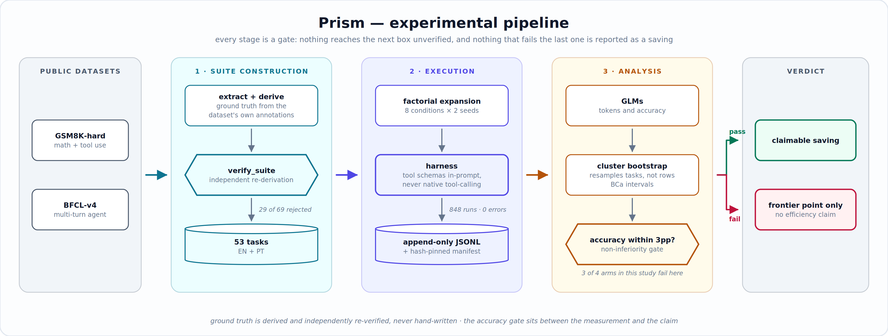
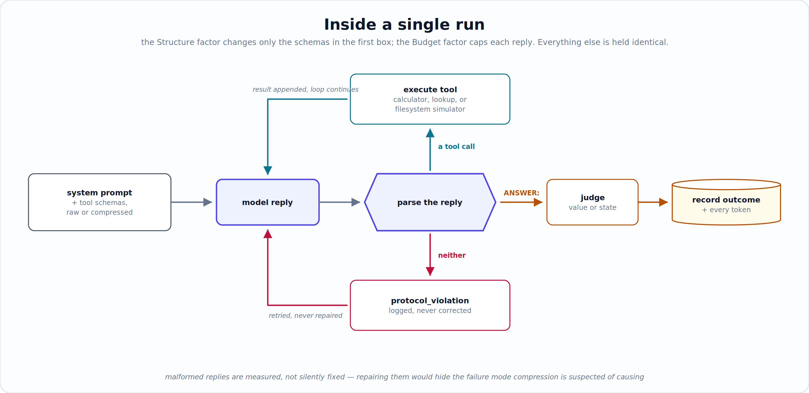

# Prism — The Token Taxes

**Three popular techniques for cutting LLM costs. Applied together, measured properly.
On a small model, they roughly doubled the cost of getting work actually done.**

A pre-registered 2×2×2 factorial experiment. 848 runs on a local 3B model, plus a
transfer check on a 70B model. Full harness, statistical pipeline, append-only
results, and an honest audit trail of everything that broke.

---

## The short version

Running large language models costs money per **token** — roughly, per word in and
per word out. So a large industry of advice has grown up around using fewer tokens:
compress the tool descriptions you send the model, cap how much it's allowed to think
out loud, watch out for languages that encode less efficiently.

Each of those saves tokens. That part is easy to verify and generally true.

The question nobody was answering: **does saving tokens actually save money?**

It sounds like the same question. It isn't — and the gap between them is where this
experiment lives.

---

## Why "fewer tokens" isn't the same as "cheaper"

Think about a factory making a physical part.

Someone finds a way to use 30% less material per unit. Real saving, easy to measure,
shows up immediately on the materials invoice. Then quality control starts rejecting
more parts, because thinner ones crack. You're now producing more units, scrapping
more of them, and paying for every scrapped one.

Your cost per unit *produced* went down. Your cost per unit *shipped* went up.

The materials saving was real. It was also a false economy.

LLM workloads have exactly this structure, and it's rarely measured this way. A failed
task still costs full price — you paid for every token the model spent getting the
wrong answer. So the number that determines your actual bill isn't tokens per call.
It's:

> ### tokens per *successful* task
> *(all tokens spent, including on failures, divided by the tasks that actually
> completed)*

That's the primary metric of this study. Everything else follows from taking it
seriously.

---

## What the experiment found

### 1. On a small model, the optimizations backfired — badly

Qwen2.5-3B, 848 runs across 53 tasks:

| Workload | Language | Cost per completed task | Success rate (before → after) | Verdict |
|---|---|---|---|---|
| Math + tools | English | **2.1× higher** | 31.3% → 16.2% | worse |
| Math + tools | Portuguese | 1.2× higher | 23.8% → 21.3% | worse |
| Multi-step agent | English | **2.0× higher** | 15.4% → 3.8% | worse |
| Multi-step agent | Portuguese | 0.7× (a real saving) | 7.7% → 7.7% | better, but fragile |

Three of four arms got **more expensive per completed task**. In English the cause is
stark: success rates roughly halved, so the token savings were swamped by paying for
twice as many failures. In one of four arms the savings survived — but that cell rests
on two successful runs per condition, which is too thin to lean on.

**In plain terms:** if this workload was costing you $1,000/month, the "optimized"
version costs about $2,100/month for the same amount of finished work.

### 2. …but the damage doesn't transfer to a larger model

The same tasks on Llama-3.3-70B:

> ⚠️ **Partial: 53 of 96 runs.** Free-tier daily quota exhausted mid-run. Six tasks
> are complete and balanced; the rest is pending.

- **50 of 53 succeeded (~94%)**, against ~31% for the 3B model on identical tasks
- The three failures fell in three different conditions — and **none** were in the
  condition that collapsed the small model

The accuracy penalty appears to be a function of **model capacity**, not of the
techniques themselves. A 3B model has no headroom to absorb compressed instructions
under a thinking budget. A 70B model absorbs both without noticing.

**The practical takeaway:** "small cheap model + aggressive token compression" is the
worst of both worlds — you pay the compression's accuracy cost precisely where the
model can least afford it. On capable models the same compression looks safe.

### 3. Two techniques that are each survivable become fatal together

One task, isolated across five independent random seeds:

| Condition | Success |
|---|---|
| Full instructions, any thinking budget | **10 / 10** |
| Compressed instructions, unlimited thinking | 3 / 5 |
| Compressed instructions **and** capped thinking | **0 / 5** |

Neither factor alone reliably breaks the task. The combination reliably does.

This is direct evidence against the assumption that these savings simply add up — the
central hypothesis this experiment was built to test. The reality is worse than
sub-additive: the interaction is actively destructive.

I tested whether this was my own compression tool's fault by restoring the specific
sentence it had trimmed. **It didn't help** (still 3/5). That killed the convenient
explanation and left the interaction standing as real, so the tool was frozen instead
of tuned further. Continuing to patch it would have amounted to engineering away the
finding.

### 4. The language effect is real, but it doesn't have a direction

Three tasks showed complete, seed-stable splits between English and Portuguese — and
they don't point the same way:

- One task: **Portuguese succeeds 5/5, English fails 5/5.** The English run invents a
  multiplication that appears nowhere in the problem.
- Another: the exact reverse. Portuguese drops a dimension of a 2-D problem.
- A third: Portuguese fails uniformly; English depends on the other two factors.

A native speaker reviewed all three translations and approved them unchanged. The
failures are in model comprehension, not translation quality. So this argues against a
simple "non-English tax" and toward **task-specific comprehension failures that can
land on either language** — including, in one case, on English.

This finding is why the localization protocol changed mid-project: from
back-translation review (which cannot detect this, since the translations are correct)
to running the model in both languages and comparing outcomes directly.

---

## How it was measured

### The pipeline end to end

Every stage below is a gate: nothing reaches the next box unverified, and nothing that
fails the last one gets reported as a saving.

<p align="center">
  
</p>

The two properties worth noticing: **ground truth is derived and independently
re-verified rather than hand-written**, and **the accuracy gate sits between the
measurement and the claim** — which is exactly why three of four arms in this study
produce no claim at all.

### Design

A **2×2×2 within-task factorial**. Every task runs through all eight combinations, so
each task acts as its own control — the standard defence against tasks simply differing
in difficulty.

| Factor | Off | On | The claim being tested |
|---|---|---|---|
| **S** — Structure | Raw JSON tool schemas | Compressed schemas | Schema prose is mostly filler |
| **B** — Budget | Unconstrained reasoning | Capped output budget | Models over-explain |
| **L** — Language | English user content | Portuguese user content | Non-English inflates token counts |

**Hypotheses.** H1–H3: each factor reduces tokens per success without an accuracy
penalty beyond δ = 3pp. **H4: the three effects are additive** — the combined saving
equals the sum of the parts. H4 is the novel one; it's also the one the data most
clearly refutes.

**The non-inferiority gate.** A saving is only claimable if accuracy in the "on"
condition stays within 3 percentage points of "off". Otherwise the result is reported
as a frontier point, not a win. This gate is what converts "we saved tokens" into "we
saved money", and it's what blocks the claim in both English arms.

### Models

- **M1 (core)** — Qwen2.5-3B-Instruct-4bit, local via MLX. 53 tasks × 8 cells × 2 seeds
  = **848 runs**. Exact tokenizer counts.
- **M2 (transfer)** — Llama-3.3-70B-Versatile via Groq, single seed. Token counts from
  API usage fields only.

### Task suite (n = 53)

Both sources machine-verified rather than hand-written — a deliberate constraint after
hand-typed ground truth caused a false test failure during the pilot.

- **40 GSM8K-hard** items (≥ 3 reasoning steps) wrapped with calculator and lookup
  tools. Ground truth is auto-derived by chaining GSM8K's own `<<expr=result>>`
  annotations, then independently re-verified by a separate script. 69 candidates
  yielded 40 acceptances; **29 were dropped as unverifiable rather than guessed at.**
- **13 BFCL-v4 multi-turn** agent tasks (single-simulator-class only). Graded by
  **state comparison** against BFCL's own vendored simulator — the same methodology
  BFCL's evaluation harness uses internally — rather than by matching call strings,
  which would wrongly fail equally-valid alternate orderings.

Tool schemas are delivered **in-prompt**, never through the provider's native
tool-calling API, so the Structure factor stays a pure token intervention that behaves
identically across backends. This decision has consequences — see below.

### Inside a single run

<p align="center">
  
</p>

The **Structure** factor changes only the schemas in the first box. The **Budget**
factor caps how much the model may emit per reply. Everything else is held identical,
which is what makes the comparison a clean one.

Note the third branch: when the model breaks the protocol, that's **logged and left
alone**, never silently repaired. Quietly fixing malformed replies would hide exactly
the failure mode compression is suspected of causing — so the violation rate is treated
as data, not as noise to clean up.

### Statistics

- Negative-binomial GLM for tokens, logistic GLM for accuracy, full S×B×L factorial
- Every confidence interval from a **cluster bootstrap** resampling task IDs — never
  individual rows, which would break the pairing the design depends on — with BCa
  correction. Coverage validated at 95.0% against a 95% nominal target over 200
  simulated datasets.
- **TOST equivalence test** for H4, so "the effects are additive" has to be positively
  demonstrated rather than inferred from a failure to reject
- Holm correction across H1–H4; Benjamini-Hochberg on the exploratory family, reported
  in a separate table
- RTW computed **two independent ways** (model-marginal and direct paired) as a
  cross-check against modelling artefacts. This caught a real defect — see below.
- Cell execution order randomized per task, deterministically seeded for
  reproducibility

### The full technical numbers

| Suite · language | RTW | 95% BCa CI | Accuracy off → on | Claimable? |
|---|---|---|---|---|
| GSM8K · EN | −109.7% | (−336.6%, −3.2%) | 31.3% → 16.2% | **no** — gate failed |
| GSM8K · PT | −22.0% | (−163.2%, +33.9%) | 23.8% → 21.3% | gate passed, CI spans zero |
| BFCL · EN | −102.2% | (−637.6%, +14.2%) | 15.4% → 3.8% | **no** — gate failed |
| BFCL · PT | +28.8% | (+5.0%, +47.9%) | 7.7% → 7.7% | yes — on 2 successes/arm |

RTW ("recoverable token waste") = `1 − T_on/T_off`, where T is all-in tokens per
success. Negative means the optimized condition costs **more** per completed task.

Note the interval widths. GSM8K · PT, the largest arm at 640 runs, spans −163% to
+34% — **genuinely inconclusive**, not a demonstrated negative. That's a real
limitation of this study, diagnosed below rather than glossed over.

---

## What broke, and how it was caught

This section exists because the failures are more informative than the successes, and
because each was caught by a check built *before* it was needed.

**A boolean inversion that would have flipped every accuracy conclusion.**
`patsy`/`statsmodels` silently treats a boolean outcome column as a two-level
categorical and fits the wrong reference level. A synthetic dataset with a planted true
success rate of 0.80 came back fitted at **0.20** — an exact inversion. Every
accuracy-gate verdict would have been backwards. Caught only because the analysis
pipeline was validated against data with *known* answers before touching real results.
Fixed by explicit integer coercion, documented in the code so it can't silently
regress.

**A primary metric that wasn't measuring the pre-registered quantity.** The
model-marginal path computed tokens per *attempt*; the specification's primary outcome
is tokens per *success*. The two agreed perfectly in cells where accuracy happened to
match across conditions, and diverged by **over 100 percentage points** where it
didn't. Caught by the deliberate choice to compute the headline number two independent
ways — the cross-check existed precisely so a modelling artefact couldn't pass
unnoticed, and it earned its place on the first real run.

**Two further statistical defects**, both found by the same synthetic-recovery
approach: the negative-binomial dispersion parameter was silently fixed at 1.0 rather
than estimated, and the model produced a confident-looking result from a cell with zero
successes (perfect separation, warned about on `stderr` where it's easy to miss). Both
now detected and surfaced explicitly.

**In-prompt tool protocols are not portable across providers.** On Groq,
`gpt-oss-120b` ignores an in-prompt JSON protocol and emits a **native function call**,
which the provider validates server-side and rejects with a 400 — no usage data
returned, so the attempt can't even be counted. Adding an explicit "do not use function
calling" instruction made it worse: the request succeeded, consumed 370 output tokens,
and returned **empty content**. Llama-3.3-70B follows the same protocol perfectly with
no prompt changes at all. Worth knowing for anyone building cross-provider agent
evaluations.

**Rate limits need pacing, not retries.** Reacting to HTTP 429s is useless when the
binding constraint is a tokens-per-minute ceiling. The harness now paces proactively
against a rolling 60-second budget, honours the API's own `retry-after` value, and
distinguishes a transient throttle from an exhausted daily quota so it stops cleanly
instead of generating hundreds of error rows over hours.

**A power analysis that measured the wrong variance.** The pilot estimated the sample
size needed to detect *token* differences and concluded n = 13–39 would suffice. But
the primary metric is tokens per *success*, which inherits accuracy variance through
its denominator. With this model's low, unstable accuracy, that denominator destroys
precision — which is why two of four intervals span zero at n = 53. The study isn't
underpowered for what the pilot measured; it's underpowered for what the specification
actually asks. **This is the single most important methodological lesson here.**

---

## Limitations

Stated plainly, because they bound what the results support.

- **Underpowered for the primary metric** (above). Point estimates are large; intervals
  are wide. Only two of four cells are distinguishable from zero.
- **The pre-registration is a good-faith freeze, not a timestamped one.** The analysis
  plan and code were written and hashed before the confirmatory run, but the git
  repository wasn't initialized until afterward, so the `prereg-v1` tag was applied
  retroactively. The freeze is real; cryptographic proof of the ordering is not. The
  hash at freeze was `e584de6214e3db4e`; after the tokens-per-success correction it is
  `27ee26977f34a714` — that correction aligned the code with the written plan rather
  than changing the plan.
- **Multi-turn transfer was not testable.** BFCL runs average ~94,000 tokens each;
  against a 100,000-token daily free-tier cap, the 208-run arm would need ~97 days.
  Single-turn transfer was tested; agentic transfer was not.
- **n = 53, not the planned 80.** BFCL's variant files each confound a different
  capability with the S/B factors, so they were excluded rather than mixed in
  uninspected; padding with more GSM8K would have erased the multi-turn diversity the
  split exists for.
- **M2 uses a different model than pre-registered.** `llama-3.3-70b-versatile` replaced
  `gpt-oss-120b` after the protocol incompatibility above. Evidence-based, and it
  required no prompt change so the arms stay comparable — but it is a deviation.
- **One model family per scale.** "Small models break, large models absorb" rests on
  two models. It is a hypothesis worth testing properly, not an established result.

---

## Reproducing

```bash
pip install -r requirements.txt

# verify ground truth before any run — a mandatory gate
python -m prism.analysis.verify_suite prism/suite/w2_staging/gsm8k_extracted.json

# prove the multi-turn harness works on this machine
python prism/scripts/smoke_test_bfcl.py

# the core run: 848 attempts, local, several hours
python run_pilot.py --model mlx \
  --tasks prism/suite/w2_staging/full_suite_n53.json --seeds 2

# transfer check (needs GROQ_API_KEY; stops cleanly at the daily quota)
python run_pilot.py --model groq --model-id llama-3.3-70b-versatile \
  --tasks prism/suite/w2_staging/gsm8k_extracted.json --limit 12 --seeds 1

# analysis
python prism/scripts/run_confirmatory_analysis.py "$(ls -t results/*.jsonl | head -1)"
```

Interrupted runs resume without redoing completed work: `--resume results/<run>.jsonl`.
Resume is verified against a simulated mid-attempt crash — the hard case, where turn
records exist but the summary never landed — and produces outcomes byte-identical to an
uninterrupted run. Partial attempts are backfilled as `harness_error` so their spent
tokens stay accounted for rather than vanishing.

The compression/safety tradeoff reproduces with
`python prism/scripts/audit_compiler.py`.

---

## Repository layout

```
prism/harness/       instrument: model adapters, runners, append-only accounting
prism/analysis/      bootstrap + BCa, GLMs, confirmatory pipeline (hash-pinned)
prism/scripts/       extraction, verification, probes, localization tooling
prism/suite/         the 53-task suite (EN + PT) and its provenance
prism/vendor/        BFCL's own simulator, vendored (Apache 2.0, one disclosed patch)
results/             every run, append-only, with manifests
PRISM_SPEC.md        full design, statistical plan, and the audit trail
```

Every result file is append-only with a hash-pinned manifest recording the suite,
config, and code version that produced it. Token counts come only from API usage fields
or exact tokenizer counts; mock runs are flagged non-confirmatory and excluded from
analysis.

`PRISM_SPEC.md` Appendix B is the honest record: every design decision that was revised,
why, and what evidence forced it — including two compiler revisions, the sample-size
reduction from 80 to 53, and a third candidate fix that was tested and deliberately
**not** applied because it didn't work.

---

## What I'd do differently

- **Run the power analysis on the actual primary metric**, not a proxy for it. This is
  the one mistake that materially limits what these results can claim.
- **Initialize the repository before writing a line of code.** The pre-registration was
  written in good faith and hashed on time; the proof of that ordering was lost to an
  assumption that a `git init` had already happened.
- **Probe every provider's protocol compatibility on day one**, not at the point of
  use. The tool-call incompatibility was discoverable in five requests and instead
  surfaced after an entire arm had been designed around it.
- **Check per-run token cost against quota limits before designing an arm.** The
  multi-turn transfer arm was infeasible from the start — ~94k tokens per run against a
  100k daily cap — and one piece of arithmetic would have shown it.

The recurring theme: each of these was cheap to check early and expensive to discover
late. The checks that *were* built early — ground-truth verification, dual-computed
headline metric, synthetic-recovery tests for the analysis code — each caught a defect
that would otherwise have reached a conclusion.
